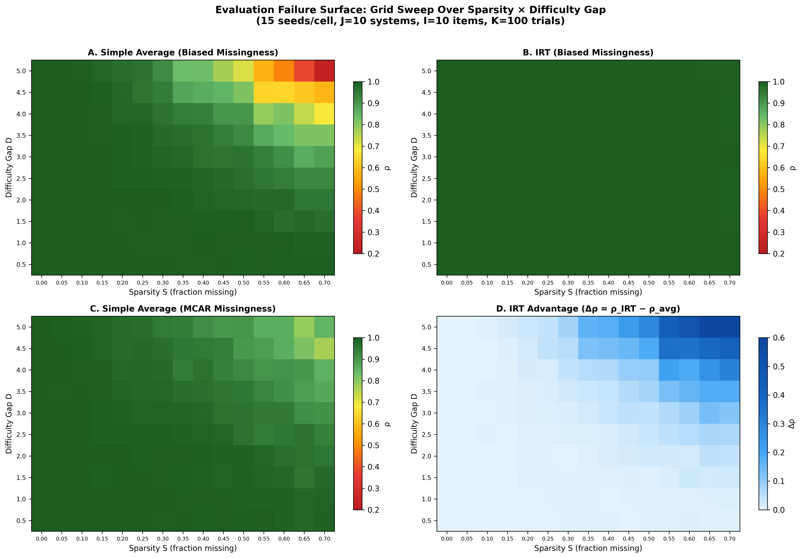

# The Scaling Law of Evaluation Failure

**Why Simple Averaging Collapses Under Data Sparsity and Item Difficulty Gaps, and How Item Response Theory Recovers Ground Truth Across Domains**

Jung Min Kang · Independent Researcher · Seoul, South Korea


[](https://creativecommons.org/licenses/by/4.0/)

Submitted to arXiv as submission `7580579`.

---

## What This Paper Does

We show that **simple averaging** — the default method for ranking systems on benchmarks — **fails predictably** when two conditions co-occur:

1. The evaluation matrix is **sparse** (not every system is tested on every item)
2. Items vary substantially in **difficulty**

Through controlled simulations across four domains (NLP, clinical trials, autonomous vehicle safety, cybersecurity) and a **150-condition grid sweep**, we map the **Evaluation Failure Surface**: ranking error increases as a function of Sparsity × Difficulty Gap, while **IRT-based estimation remains robust** (ρ ≥ 0.993 across all conditions).

<p align="center">
  
</p>

## What This Paper Does NOT Claim

- ❌ We do not claim IRT is new to AI evaluation — [Rodriguez et al. (2021)](https://aclanthology.org/2021.acl-long.346/) and [py-irt](https://github.com/nd-ball/py-irt) preceded this work.
- ❌ We do not claim real-world Physical AI data obeys 2PL IRT assumptions.
- ❌ We do not claim a precisely fitted closed-form scaling law — the power-law approximation explains only part of the variance (R² = 0.587). We describe an empirical failure surface.
- ❌ We do not provide a completed Physical AI benchmark.

## Key Results

| Metric | Value |
|--------|-------|
| Worst ρ (simple avg, biased missingness) | 0.242 |
| Worst ρ (simple avg, MCAR) | 0.770 |
| Min ρ (IRT, all conditions) | **0.993** |
| S×D interaction coefficient | γ₃ = +0.199, t = 13.05 |
| Interaction model R² | 0.777 |
| Grid conditions tested | 150 (15 S × 10 D) |

## Reproduction

### Requirements

```bash
pip install numpy scipy matplotlib
```

### Run All Experiments

```bash
# Four-domain simulation (< 60 seconds)
python src/grid_sweep_final.py
```

This regenerates the experiment outputs and analysis figures:
- `outputs/grid_summary.csv` — per-cell mean/std
- `outputs/grid_raw_runs.csv` — per-seed raw results
- `outputs/regression_report.txt` — statistical analysis
- `figures/figure2_composite.png` — paper Figure 2

### Increase Seeds for Paper-Grade Results

Edit `N_SEEDS` in `src/grid_sweep_final.py`:

```python
N_SEEDS = 30  # or 50 for stronger confidence
```

## Repository Structure

```
evaluation-failure-scaling-law/
├── README.md
├── LICENSE
├── CITATION.cff
├── requirements.txt
├── paper/
│   ├── Kang_2026_EFSL_FINAL.pdf
│   ├── main.tex
│   └── figures/
│       └── figure2_composite.png
├── src/
│   └── grid_sweep_final.py
├── figures/
│   └── figure2_composite.png
└── outputs/
    ├── grid_summary.csv
    ├── grid_raw_runs.csv
    └── regression_report.txt
```

## Citation

```bibtex
@article{kang2026evaluation,
  title={The Scaling Law of Evaluation Failure: Why Simple Averaging Collapses Under Data Sparsity and Item Difficulty Gaps, and How Item Response Theory Recovers Ground Truth Across Domains},
  author={Kang, Jung Min},
  journal={arXiv preprint},
  year={2026}
}
```

## Related Work

- [py-irt](https://github.com/nd-ball/py-irt) — Bayesian IRT library for Python
- [Rodriguez et al. (2021)](https://aclanthology.org/2021.acl-long.346/) — IRT-based NLP leaderboards
- [Zhou et al. (2026)](https://arxiv.org/abs/2505.15055) — PSN-IRT for LLM benchmarks
- [Ndzomga (2026)](https://arxiv.org/abs/2603.23749) — Efficient agent benchmarking via IRT-motivated task selection

## License

This work is licensed under [CC BY 4.0](https://creativecommons.org/licenses/by/4.0/).
